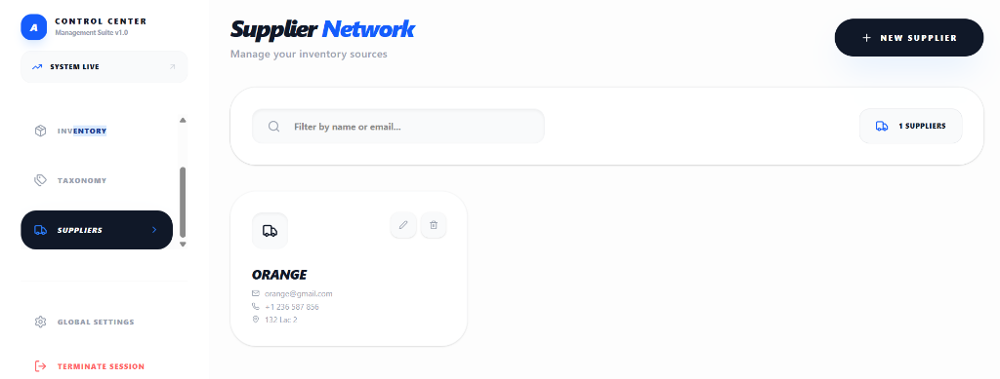

# E-Shop Pro: Full-Stack E-commerce Management Suite

E-Shop Pro is a modern, premium full-stack e-commerce platform built with **Spring Boot 3** and **React**. It features a stunning administrative dashboard, robust inventory management, and a seamless storefront experience.

---

## 🌟 Key Features

### 🛒 Premium Storefront
- **Modern Grid Layout**: A visually stunning product grid with high-end hover effects.
- **Dynamic Filtering**: Filter products by category or search in real-time.
- **Smart Image Fallbacks**: Automatic replacement of broken links with high-quality placeholder imagery to ensure a perfect UI at all times.
- **Integrated Shopping Cart**: A fluid, context-aware shopping experience.

### 🛡️ Administrative Control Center
- **Executive Dashboard**: Real-time business metrics including inventory distribution and revenue estimates.
- **Inventory Management**: Full CRUD operations for products with category and supplier associations.
- **Taxonomy Engine**: Management of product categories to organize your catalog.
- **Supplier Network**: A dedicated module to manage global suppliers and their contact details.
- **Role-Based Security**: Secure JWT-based authentication for Customers and Administrators.

---

## 📸 Visual Tour

### 🏁 Landing Page


### 🛍️ Storefront Grid


### 📊 Admin Dashboard


### 📦 Inventory Management


### 🚚 Supplier Network


---

## 🛠️ Technical Stack

### Backend
- **Core**: Spring Boot 3
- **Language**: Java 23 (JDK 23 recommended)
- **Security**: Spring Security with JWT (JSON Web Token)
- **Database**: MySQL 8.0
- **Persistence**: Spring Data JPA / Hibernate
- **Build Tool**: Maven

### Frontend
- **Framework**: React 18+ (Vite)
- **Styling**: Tailwind CSS 4 & Vanilla CSS
- **Icons**: Lucide React
- **State Management**: React Context API
- **Networking**: Axios

---

## 🚀 Getting Started

### Prerequisites
- **JDK 23** installed
- **Node.js** & npm installed
- **MySQL** Server running

### 1. Database Setup
1. Create a MySQL database named `projet_db`.
2. Configure your credentials in `src/main/resources/application.properties`.

### 2. Running the Backend
```bash
$env:JAVA_HOME="C:\Program Files\Java\jdk-23" 
.\mvnw spring-boot:run
```

### 3. Running the Frontend
```bash
cd frontend
npm install
npm run dev
```

---

## 🏗️ Project Structure

```text
Projet_frontend/
├── src/main/java/              # Backend Source
│   └── org.example.projet_frontend/
│       ├── config/             # Security & JWT Config
│       ├── controllers/        # REST Endpoints
│       ├── entities/           # JPA Models
│       └── repositories/       # Data Access Layer
├── frontend/                   # React Source
│   ├── src/
│   │   ├── components/         # Reusable UI
│   │   ├── pages/              # View Routes
│   │   ├── services/           # API Interaction
│   │   └── context/            # Global State
└── docs/screenshots/           # Visual Assets
```

---

## 🧪 Testing Credentials

| Role | Email | Password |
| :--- | :--- | :--- |
| **Admin** | `admin@eshop.com` | `admin123` |
| **Customer** | `user@example.com` | `user123` |

---

Developed with ❤️ by Asma BELHIBA
