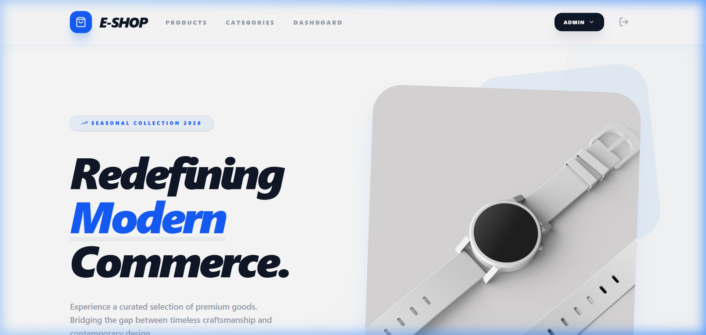
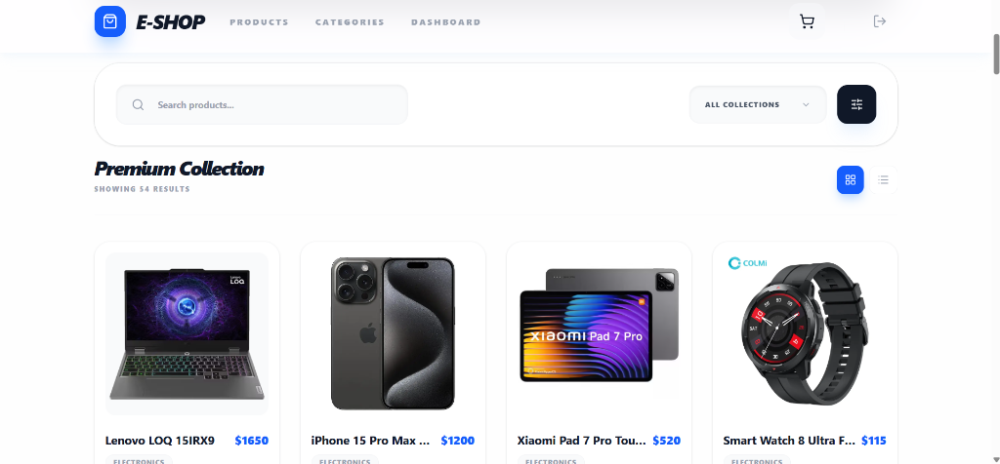
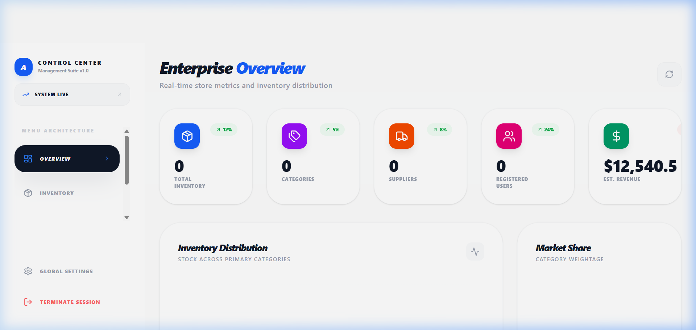
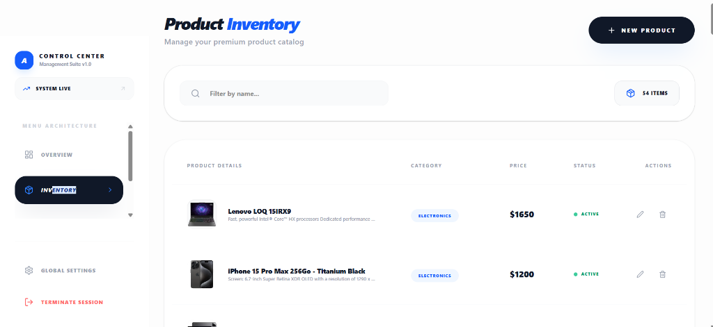

# E-Shop Pro: Full-Stack E-commerce Suite

This project is a comprehensive full-stack e-commerce application developed using **Spring Boot 3** for the backend and **React** for the frontend. It was designed to handle high-level inventory management and provides a seamless shopping experience for customers.

The application is structured into two main parts: a responsive storefront for users and a robust administrative control center for managing products, categories, and suppliers.

---

## Technical Overview

### Core Stack
- **Backend**: Spring Boot 3 / Java 23 (utilizing Spring Security with JWT for authentication).
- **Frontend**: React 18+ (Vite) styled with Tailwind CSS and Vanilla CSS.
- **Database**: MySQL 8.0 for persistent storage.
- **Data Access**: Spring Data JPA / Hibernate for efficient relational mapping.

### Main Modules
- **Public Storefront**: A dynamic grid layout for browsing products with real-time search and category filtering.
- **Shopping Cart**: A fully integrated cart system that handles item selection and calculations.
- **Admin Dashboard**: Real-time business metrics and summary of current stock.
- **Inventory Management**: Complete CRUD operations for products, including associations with suppliers and categories.
- **Supplier & Category Engine**: Dedicated modules for organizing the product catalog and managing the supply chain.

---

## Visual Tour

### Homepage & Hero Section
The landing page introduces the project's design philosophy, focusing on a premium user experience.


### Storefront Products
A responsive grid showing products with dynamic filtering options.


### Shopping Cart
The newly implemented shopping cart allows users to review their selections before checkout.


### Administrative Dashboard
Overview of the business performance and inventory status.


### Inventory & Stock Management
The tools used by administrators to manage the entire product catalog.


---

## Architectural Choices

One of the key focus areas of this project was the mapping strategy between entities. I used a mix of unidirectional and bidirectional relationships to balance performance and developer experience:

- **Bidirectional Mappings**: Used for the `Order` ⇄ `OrderItem` relationship. This allows for easy navigation across the entire order graph, which is essential for complex order processing and cascading operations.
- **Unidirectional Mappings**: Used for `Product` → `Category` and `Product` → `Supplier`. These were kept unidirectional to minimize coupling and avoid unnecessary complexity in the object graph, as reverse navigation is handled through repository queries.

---

## Setup & Local Development

### Prerequisites
- JDK 23
- Node.js & npm
- MySQL Server

### 1. Database Configuration
1. Create a MySQL database named `projet_db`.
2. Update the credentials in `src/main/resources/application.properties` if necessary.

### 2. Run the Backend
```bash
# Ensure JAVA_HOME points to JDK 23
$env:JAVA_HOME="C:\Program Files\Java\jdk-23" 
.\mvnw spring-boot:run
```

### 3. Run the Frontend
```bash
cd frontend
npm install
npm run dev
```

---

## Project Structure

```text
Projet_frontend/
├── src/main/java/              # Spring Boot Backend
│   └── org.example.projet_frontend/
│       ├── config/             # Security & Security Config
│       ├── controllers/        # REST Endpoints
│       ├── entities/           # JPA Models
│       └── repositories/       # Data Access
├── frontend/                   # React Frontend (Vite)
│   ├── src/
│   │   ├── components/         # UI Elements
│   │   ├── pages/              # View Routes
│   │   ├── services/           # API Logic
│   │   └── context/            # Auth & State
└── docs/screenshots/           # Project Images
```

---

## Test Credentials

| Account Type | Email | Password |
| :--- | :--- | :--- |
| **Administrator** | `admin@eshop.com` | `admin123` |
| **Customer** | `user@example.com` | `user123` |

---

*Developed by Asma BELHIBA*
